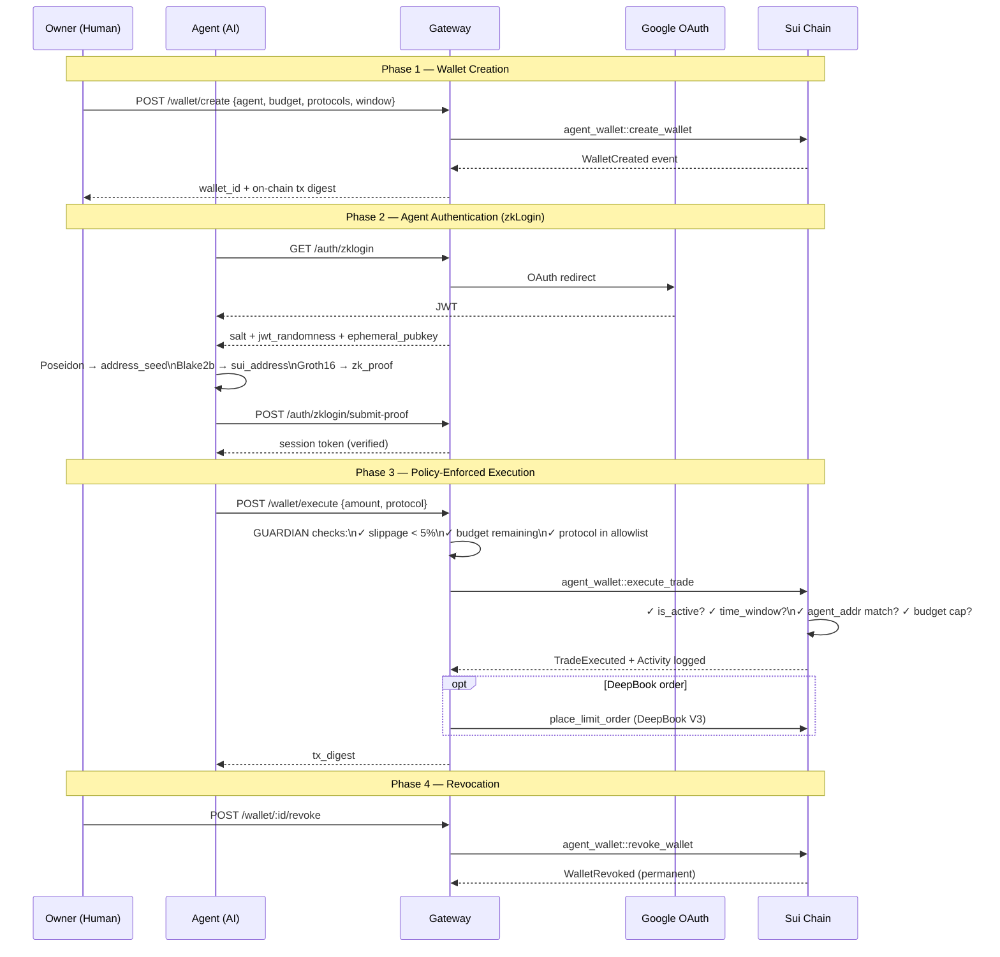
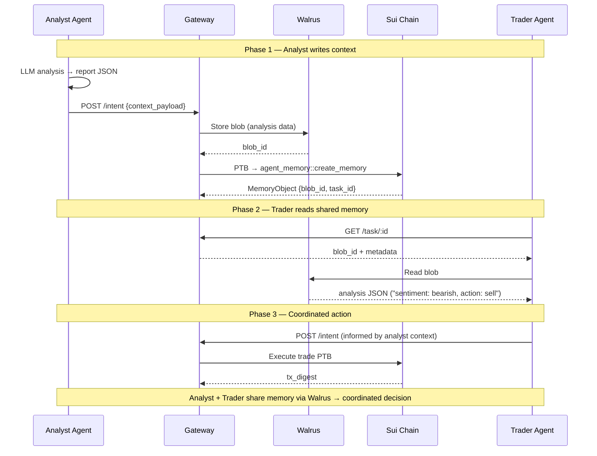

# Sui-Nexus

**The settlement infrastructure for the AI agent economy on Sui.**

> 🏆 Sui Overflow 2026 Submission — Agentic Web (Intent Engine) + Walrus Tracks
>
> **Deployed on Sui Testnet**: `0x28c35c355590d81c80f86b43b42d21041fdbc0ab34546ff558b48270a4ff277d`
> ([Verify on Explorer](https://suiexplorer.com/object/0x28c35c355590d81c80f86b43b42d21041fdbc0ab34546ff558b48270a4ff277d?network=testnet))

---

## Design Philosophy

### The Problem

AI agents today face three fundamental blockers on blockchain:

| Blocker | Current State | Sui-Nexus Solution |
|---------|--------------|-------------------|
| **Key custody** | Agents must hold private keys → security risk, compliance nightmare | HMAC + zkLogin — agents authenticate without keys |
| **Statelessness** | Agents lose context across sessions → can't build on past decisions | Walrus persistent memory + Move MemoryObject on-chain |
| **No guardrails** | Agents have unlimited access → one bad trade drains everything | Move-enforced policies: budget caps, protocol scope, time windows |

### The Insight

> **"Not another AI agent — the settlement layer every AI agent on Sui needs."**

Most projects build agents that trade. Sui-Nexus builds the infrastructure that makes agent trading safe, auditable, and composable. It's the difference between building a car and building the road.

### Design Principles

1. **Sui-native**: Every feature maps to a Sui primitive — PTB, Move objects, zkLogin, Walrus. No bolt-on payments.
2. **Trust-minimized**: Policy enforcement lives on-chain (Move), not in middleware. The gateway is a relay, not an authority.
3. **Graceful degradation**: Works without Redis. Fails loudly without Kafka. Every dependency is optional where possible.
4. **Agent-agnostic**: Any AI agent (Python, TypeScript, Rust) can connect via standard HTTP + HMAC.

---

## Architecture

```mermaid
flowchart TB
    subgraph AgentLayer[" AI AGENT LAYER "]
        direction LR
        Agent1["Analyst Agent\n(Python, LLM)"]
        Agent2["Trader Agent\n(Python, LLM)"]
        Agent3["Custom Agents\n(Any Language)"]
    end

    subgraph Gateway[" GO GATEWAY (Gin) "]
        direction TB
        subgraph MW[" Middleware "]
            direction LR
            HMAC["HMAC Auth"]
            RL["Rate Limiter"]
            CORS["CORS / Recovery"]
        end
        subgraph API[" API Endpoints "]
            direction LR
            Intent["/api/v1/intent\nTrade submission"]
            Wallet["/api/v1/wallet/*\nPolicy-enforced ops"]
            ZK["/api/v1/auth/zklogin\nzkLogin OAuth"]
            WS["/ws\nReal-time dashboard"]
        end
        subgraph Guardian[" GUARDIAN RISK LAYER "]
            direction LR
            SL["Slippage <5%"]
            BC["Budget Cap"]
            PA["Protocol Allowlist"]
        end
        MW --> API --> Guardian
    end

    subgraph Infra[" INFRASTRUCTURE "]
        direction LR
        Kafka["Kafka Queue\n(async processing)"]
        Redis["Redis Cache\n(task/wallet state)"]
        WSHub["WebSocket Hub\n(live push)"]
    end

    subgraph PTB[" PTB BUILDER & EXECUTOR "]
        direction LR
        Swap["Swap (Cetus)"]
        Transfer["Transfer"]
        AgentW["AgentWallet"]
        DB["DeepBook Orders"]
    end

    subgraph Sui[" SUI BLOCKCHAIN "]
        direction TB
        subgraph Move[" Move Contracts "]
            direction LR
            AW["agent_wallet\n· budget caps\n· protocol scope\n· time windows\n· revocation"]
            AM["agent_memory\n· Walrus blob ID\n· task reference"]
            DEX["DeepBook / Cetus\n· limit orders\n· swap routes"]
        end
        WalrusLayer["WALRUS\nDecentralized AI context, logs, and cross-agent memory"]
        Move --> WalrusLayer
    end

    AgentLayer -- "HMAC" --> Gateway
    Gateway --> Infra
    Infra --> PTB
    PTB --> Sui
```

### System Overview



### Agent Wallet Flow (zkLogin + Policy Enforcement)



### Walrus Memory Flow (Cross-Agent Context)



---

## Sui Primitives Used

| Primitive | Usage | Depth |
|-----------|-------|-------|
| **PTB (Programmable Transaction Blocks)** | Atomic multi-agent settlement: swap → distribute to N agents in one tx | Core |
| **Move Objects** | AgentWallet (policy state), MemoryObject (Walrus blob ref) | Core |
| **zkLogin** | Agent identity: Google OAuth → client-side ZK proof → Sui address | Core |
| **Walrus** | AI context storage: agent analysis, logs, cross-agent shared memory | Core |
| **DeepBook V3** | Limit order placement within agent wallet policy bounds | Integration |

---

## Track Submissions

### One-Command Judge Demo

Run the product locally without Kafka, Redis, zkLogin OAuth credentials, or Sui private keys:

```bash
HACKATHON_DEMO_MODE=true ./scripts/demo/run_agent_wallet_demo.sh
```

`HACKATHON_DEMO_MODE` is an explicit judge-friendly simulation path. It keeps the same HTTP API, PTB builder, Move-call plans, wallet policy cache, Guardian checks, WebSocket stream, and Walrus memory references, but uses deterministic local digests instead of submitting live Sui transactions. The live testnet path remains available by disabling demo mode and providing Kafka, Redis, zkLogin, signer, gas coin, and package configuration.

Open `web/dashboard.html` after the gateway starts to use the interactive judge console.

### Track 1: Agentic Web — "Intent Engine + Agent Wallet with zkLogin"

**Key Demo**: `scripts/demo/agent_wallet_demo.py`

Demonstrates the full Intent Engine + Agent Wallet flow with 9/9 requirements:

1. **Owner creates wallet** with Move-enforced policy (500 SUI budget, DeepBook only, 24h window)
2. **Agent authenticates via zkLogin** (Google OAuth → client-side ZK proof → session)
3. **Agent executes trade** within policy bounds → Guardian passes → on-chain execution
4. **Agent attempts overspend** → rejected by Move contract (budget cap enforced on-chain)
5. **Owner revokes wallet** → agent permanently frozen → on-chain event emitted
6. **Activity log verified** on-chain via Sui Explorer

**Innovation**: Not an agent — the settlement layer every agent needs. zkLogin identity + Move policy enforcement + Guardian risk layer + DeepBook execution. Intent Engine sub-track: agents submit *intents* not transactions — the gateway builds, validates, and executes atomic PTBs with on-chain policy enforcement.

### Track 2: Walrus — "AI Agent Memory System"

**Key Demo**: `scripts/demo/walrus_memory_demo.py`

Demonstrates cross-agent persistent memory with 7/7 requirements:

1. **Analyst Agent** analyzes market news via LLM → writes context to Walrus
2. **Gateway** stores blob → mints MemoryObject on-chain (blob_id + task_id)
3. **Trader Agent** queries shared memory → reads analyst's context from Walrus
4. **Trader executes** informed by analyst's research → coordinated multi-agent action

**Innovation**: Walrus as the memory layer for the AI agent economy. Not just storage — verifiable, composable, on-chain referenced memory that persists across sessions and agents.

### On-Chain Verification

| Contract | Testnet Address | Explorer |
|----------|----------------|----------|
| Package | `0x28c35c355590d81c80f86b43b42d21041fdbc0ab34546ff558b48270a4ff277d` | [View](https://suiexplorer.com/object/0x28c35c355590d81c80f86b43b42d21041fdbc0ab34546ff558b48270a4ff277d?network=testnet) |
| Upgrade Cap | `0x7bd41eb7253f93e03f84fe2c963347b62a5cae57a29c8200c92e9a4c6bbfb06b` | [View](https://suiexplorer.com/object/0x7bd41eb7253f93e03f84fe2c963347b62a5cae57a29c8200c92e9a4c6bbfb06b?network=testnet) |

---

## Quick Start

### Prerequisites

- Go 1.21+
- Kafka (required for `/api/v1/intent` processing)
- Redis (optional — task lookup degrades without it)
- Sui CLI (for Move contract deployment)
- A funded Sui testnet account

### Environment Variables

```bash
# Core
export HMAC_SECRET_KEY="dev-secret-key-change-in-prod"
export KAFKA_BROKERS="localhost:9092"
export REDIS_ADDR="localhost:6379"
export SUI_RPC_URL="https://fullnode.testnet.sui.io"
export SUI_SIGNER_PRIVATE_KEY="suiprivkey..."
export SUI_GAS_OBJECT_ID="0x..."
export SUI_GAS_BUDGET="10000000"

# zkLogin (for Agentic Web track)
export ZKLOGIN_ENABLED=true
export ZKLOGIN_CLIENT_ID="your-google-client-id"
export ZKLOGIN_CLIENT_SECRET="your-google-client-secret"

# Agent Wallet
export AGENT_WALLET_ENABLED=true
export AGENT_WALLET_PACKAGE_ID="0x28c35c355590d81c80f86b43b42d21041fdbc0ab34546ff558b48270a4ff277d"

# DeepBook (for real DEX orders)
export DEEPBOOK_PACKAGE_ID="0xdee9"     # DeepBook V3 testnet package
export DEEPBOOK_POOL_ID="0x..."         # SUI/USDC pool on testnet
```

### Deploy Move Contracts

```bash
cd move
sui move build
sui client publish --gas-budget 100000000
# Save the package ID → AGENT_WALLET_PACKAGE_ID
```

### Start Services

```bash
docker run -d --name kafka -p 9092:9092 apache/kafka
docker run -d --name redis -p 6379:6379 redis:alpine
```

### Run Gateway

```bash
go run cmd/gateway/main.go
```

### Run Demos

```bash
# Agentic Web Track Demo
python3 scripts/demo/agent_wallet_demo.py

# Walrus Track Demo
python3 scripts/demo/walrus_memory_demo.py

# Original Agent Trading Demo
./scripts/demo/run_demo.sh
```

### Open Dashboard

```bash
open web/dashboard.html
```

---

## API Reference

| Method | Path | Auth | Purpose |
|--------|------|------|---------|
| `GET` | `/health` | None | Health check (Kafka/Redis status) |
| `GET` | `/ws` | None | WebSocket real-time task updates |
| `GET` | `/api/v1/auth/zklogin` | OAuth | Initiate Google OAuth flow |
| `GET` | `/api/v1/auth/zklogin/callback` | OAuth | OAuth callback → zkLogin params |
| `POST` | `/api/v1/auth/zklogin/submit-proof` | Session | Submit ZK proof from client |
| `POST` | `/api/v1/auth/zklogin/verify` | Session | Verify zkLogin session |
| `POST` | `/api/v1/wallet/create` | None | Create Agent Wallet (Move) |
| `POST` | `/api/v1/wallet/execute` | zkLogin | Agent executes trade (Guardian + Move) |
| `POST` | `/api/v1/wallet/:id/revoke` | None | Owner revokes wallet |
| `GET` | `/api/v1/wallet/:id` | None | Query wallet state |
| `GET` | `/api/v1/wallet/:id/activity` | None | Query on-chain activity log |
| `POST` | `/api/v1/intent` | HMAC | Submit agent trading intent |
| `GET` | `/api/v1/task/:task_id` | HMAC | Query task status |
| `POST` | `/api/v1/parse` | None | NLP intent parsing |

---

## Project Structure

```
sui-nexus/
├── cmd/gateway/main.go           # Entry point
├── internal/
│   ├── config/config.go          # 30+ env-driven config fields
│   ├── gateway/
│   │   ├── handler.go            # HTTP handlers (intent, task, health)
│   │   ├── router.go             # Gin route registration
│   │   ├── middleware.go         # HMAC auth, rate limiter, CORS
│   │   ├── websocket.go          # WebSocket hub for live push
│   │   ├── agent_wallet.go       # Agent Wallet handlers + Guardian
│   │   ├── parser_client.go      # NLP service client
│   │   └── zklogin/              # zkLogin OAuth + session management
│   │       ├── provider.go       # Google/Twitch OAuth providers
│   │       ├── proof.go          # ZK proof submission types
│   │       └── ephemeral.go      # Ephemeral key manager
│   ├── kafka/                    # Kafka producer + consumer
│   ├── model/                    # Domain types
│   │   ├── intent.go             # Intent, Task, AgentShare
│   │   ├── task.go               # TaskEvent for streaming
│   │   └── agent_wallet.go       # Wallet policy, activity types
│   ├── ptb/
│   │   ├── builder.go            # PTB builder (Swap, Transfer, Wallet, DeepBook)
│   │   └── executor.go           # PTB executor (Sui SDK + raw RPC)
│   ├── storage/redis.go          # Redis task/wallet cache
│   └── walrus/client.go          # Walrus HTTP client
├── pkg/hmac/signer.go            # HMAC-SHA256 signing
├── move/
│   ├── sources/
│   │   ├── agent_wallet.move     # Agent Wallet Move contract
│   │   └── agent_memory.move     # MemoryObject for Walrus blob refs
│   └── Move.toml
├── scripts/
│   ├── demo/
│   │   ├── agent_wallet_demo.py  # Agentic Web track demo
│   │   ├── walrus_memory_demo.py # Walrus track demo
│   │   ├── analyst_agent.py      # LLM market analyst
│   │   ├── trader_agent.py       # Trade executor
│   │   └── llm_client.py         # OpenAI/Groq unified client
│   └── nlp/intent_parser.py      # NLP intent parsing service
├── web/dashboard.html            # Real-time WebSocket dashboard
└── docs/                         # Integration guides, demo scripts
```

---

## Key Features

- **HMAC Authentication**: AI agents authenticate via HMAC-SHA256 signatures — no private key custody
- **zkLogin Identity**: Agent identity via Google OAuth + client-side ZK proof (Poseidon + Blake2b + Groth16)
- **Atomic PTB Settlement**: Multi-agent, multi-step transactions in one Sui PTB
- **On-Chain Policy Enforcement**: Budget caps, protocol scope, time windows enforced by Move contract
- **Guardian Risk Layer**: Pre-flight slippage, concentration, and protocol health checks
- **Activity Log**: Every agent action recorded on-chain via Move events
- **Owner Revocation**: Instant, irreversible wallet freeze by owner
- **DeepBook Integration**: Limit order placement within policy bounds
- **Walrus Memory**: Decentralized context storage with on-chain blob references
- **Graceful Degradation**: Works without Redis; fails cleanly without Kafka
- **WebSocket Dashboard**: Real-time task and wallet status monitoring
- **NLP Intent Parsing**: Natural language → structured DeFi intents

## License

MIT
