# Sui-Nexus

**The settlement infrastructure for the AI agent economy on Sui.**

> 🏆 Sui Overflow 2026 — Agentic Web + Walrus Tracks
>
> **Live on Sui Testnet**: `0x262b81797305980a5ddf2c509a6ac8fb9577dee6ac6c96ceba6580bd3dde5058`
> ([Verify on Explorer](https://suiexplorer.com/object/0x262b81797305980a5ddf2c509a6ac8fb9577dee6ac6c96ceba6580bd3dde5058?network=testnet))
>
> Original v1 still addressable at `0xa051...4453` (audit trail, never deleted on Sui).
>
> **v2 upgrade** (tx `HEpaW4...AH5G`): on-chain `expected_price > 0` is now a hard requirement
> (was previously a stub). See [DEVLOG.md](./DEVLOG.md) and `move/sources/agent_wallet.move`
> `execute_trade` for the rationale.

---

## TL;DR

Sui-Nexus is the missing middle layer between AI agents and Sui. Instead of building another
agent that trades, it builds the **settlement infrastructure** those agents need to trade safely
on-chain: HMAC + zkLogin auth, Move-enforced wallet policy, Walrus-backed memory, and PTB-based
atomic execution.

```bash
# judge-friendly demo — no setup, no keys, no chain
HACKATHON_DEMO_MODE=true ./scripts/demo/run_agent_wallet_demo.sh
# open the dashboard it prints
```

---

## The Problem

| Blocker | Today | Sui-Nexus |
|---|---|---|
| **Key custody** | Agent must hold private keys → security + compliance risk | HMAC + zkLogin — no keys on the agent |
| **Statelessness** | Agents lose context across sessions → no learning loop | Walrus + `MemoryObject` on-chain |
| **No guardrails** | One bad prompt drains the wallet | Move-enforced: budget cap, protocol allowlist, time window |

---

## Architecture

```mermaid
flowchart TB
    subgraph AgentLayer[" AI AGENT LAYER "]
        direction LR
        Agent1["Analyst Agent\n(Python, LLM)"]
        Agent2["Trader Agent\n(Python, LLM)"]
        Agent3["Custom Agents\n(Any Language)"]
    end

    subgraph Gateway[" GO GATEWAY (Gin) "]
        direction TB
        subgraph MW[" Middleware "]
            direction LR
            HMAC["HMAC Auth"]
            RL["Rate Limiter"]
            CORS["CORS / Recovery"]
        end
        subgraph API[" API Endpoints "]
            direction LR
            Intent["/api/v1/intent\nTrade submission"]
            Wallet["/api/v1/wallet/*\nPolicy-enforced ops"]
            ZK["/api/v1/auth/zklogin\nzkLogin OAuth"]
            WS["/ws\nReal-time dashboard"]
        end
        subgraph Guardian[" GUARDIAN RISK LAYER "]
            direction LR
            SL["Slippage <5%"]
            BC["Budget Cap"]
            PA["Protocol Allowlist"]
        end
        MW --> API --> Guardian
    end

    subgraph Infra[" INFRASTRUCTURE "]
        direction LR
        Kafka["Kafka Queue\n(async processing)"]
        Redis["Redis Cache\n(task/wallet state)"]
        WSHub["WebSocket Hub\n(live push)"]
    end

    subgraph PTB[" PTB BUILDER & EXECUTOR "]
        direction LR
        Swap["Swap (Cetus)"]
        Transfer["Transfer"]
        AgentW["AgentWallet"]
        DB["DeepBook Orders"]
    end

    subgraph Sui[" SUI BLOCKCHAIN "]
        direction TB
        subgraph Move[" Move Contracts "]
            direction LR
            AW["agent_wallet\n· budget caps\n· protocol scope\n· time windows\n· revocation"]
            AM["agent_memory\n· Walrus blob ID\n· task reference"]
            DEX["DeepBook / Cetus\n· limit orders\n· swap routes"]
        end
        WalrusLayer["WALRUS\nDecentralized AI context, logs, and cross-agent memory"]
        Move --> WalrusLayer
    end

    AgentLayer -- "HMAC" --> Gateway
    Gateway --> Infra
    Infra --> PTB
    PTB --> Sui
```



### Key flows

- **Agent Wallet lifecycle** — Owner creates wallet (Move policy) → Agent authenticates via
  zkLogin (Google OAuth → client-side ZK proof) → Agent submits intent → Guardian pre-checks
  (slippage / budget / protocol) → PTB atomically enforces policy on-chain and executes via
  DeepBook/Cetus → Owner can revoke at any time.
- **Cross-agent memory** — Analyst writes LLM context to Walrus + mints a `MemoryObject` on-chain
  (blob_id + task_id) → Trader reads blob via task lookup → Trader submits an informed intent.
  Two agents, one shared memory, no off-chain coordination.

---

## Sui Primitives

| Primitive | Usage | Depth |
|---|---|---|
| **PTB** | Atomic multi-agent settlement: swap → distribute to N agents in one tx | Core |
| **Move Objects** | `AgentWallet` (policy state), `MemoryObject` (Walrus blob ref) | Core |
| **zkLogin** | Agent identity: Google OAuth → client-side ZK proof → Sui address | Core |
| **Walrus** | AI context storage: agent analysis, logs, cross-agent shared memory | Core |
| **DeepBook V3** | Limit order placement within agent wallet policy bounds | Integration |

---

## Track Submissions

### 🚀 One-Command Judge Demo (no setup needed)

```bash
HACKATHON_DEMO_MODE=true ./scripts/demo/run_agent_wallet_demo.sh
```

`HACKATHON_DEMO_MODE` is an explicit judge-friendly simulation path. It keeps the same HTTP
API, Move-call plans, wallet policy cache, Guardian checks, WebSocket stream, and Walrus memory
references, but uses deterministic local digests instead of submitting live Sui transactions.
The live testnet path remains available by disabling demo mode and configuring signer / gas /
funding / package IDs.

It then prints the dashboard URL — open it in a browser for the interactive console.

### Track 1 — Agentic Web: "Intent Engine + Agent Wallet with zkLogin"

**Key demo**: `scripts/demo/agent_wallet_demo.py` — exercises the full lifecycle:

1. Owner creates wallet with Move-enforced policy (e.g. 500 SUI budget, DeepBook only, 24h window)
2. Agent authenticates via zkLogin (Google OAuth → client-side ZK proof → session)
3. Agent executes trade within policy → Guardian passes → on-chain execution
4. Agent attempts overspend → rejected by Move contract (budget cap enforced on-chain)
5. Owner revokes wallet → agent permanently frozen → `WalletRevoked` event emitted
6. Activity log verified on-chain via Sui Explorer

### Track 2 — Walrus: "AI Agent Memory System"

**Key demo**: `scripts/demo/walrus_memory_demo.py` — cross-agent persistent memory:

1. Analyst Agent analyzes market news via LLM → writes context to Walrus
2. Gateway stores blob → mints `MemoryObject` on-chain (blob_id + task_id)
3. Trader Agent queries shared memory → reads analyst's context from Walrus
4. Trader submits a follow-up intent informed by the analyst's research

### On-Chain Verification (Sui Testnet)

| Contract | Address | Explorer |
|---|---|---|
| Package | `0x262b81797305980a5ddf2c509a6ac8fb9577dee6ac6c96ceba6580bd3dde5058` (v2) | [View](https://suiexplorer.com/object/0x262b81797305980a5ddf2c509a6ac8fb9577dee6ac6c96ceba6580bd3dde5058?network=testnet) |
| Upgrade Cap | `0x225f7b278c1fc2d3b5cf3d38a5f5e344463aaaf67f52a97b4a51008499a2145f` | [View](https://suiexplorer.com/object/0x225f7b278c1fc2d3b5cf3d38a5f5e344463aaaf67f52a97b4a51008499a2145f?network=testnet) |

---

## Quick Start

### Option A — Judge demo (recommended, 30 seconds)

```bash
HACKATHON_DEMO_MODE=true ./scripts/demo/run_agent_wallet_demo.sh
```

Open the printed dashboard URL.

### Option B — Live testnet

```bash
# 1. env (minimum required for live mode)
export HMAC_SECRET_KEY="$(openssl rand -hex 32)"
export SUI_RPC_URL="https://fullnode.testnet.sui.io"
export SUI_SIGNER_PRIVATE_KEY="suiprivkey..."
export SUI_GAS_OBJECT_ID="0x..."
export SUI_FUNDING_OBJECT_ID="0x..."        # dedicated coin for wallet funding
export SUI_GAS_BUDGET="10000000"
export AGENT_WALLET_PACKAGE_ID="0x262b81797305980a5ddf2c509a6ac8fb9577dee6ac6c96ceba6580bd3dde5058"
export DEEPBOOK_PACKAGE_ID="0xdee9"         # DeepBook V3 testnet
export DEEPBOOK_POOL_ID="0x..."             # SUI/USDC pool

# 2. (optional) infra — Redis is optional, Kafka is only needed for /api/v1/intent
docker run -d --name redis -p 6379:6379 redis:alpine

# 3. gateway
go run cmd/gateway/main.go

# 4. live smoke check
bash scripts/demo/live_testnet_smoke.sh
```

### Option C — Deploy Move contracts from source

```bash
cd move
sui move build
sui client publish --gas-budget 100000000   # save the new package ID
```

See [docs/HACKATHON_GUIDE.md](docs/HACKATHON_GUIDE.md) for the full guide including zkLogin
OAuth setup and Walrus storage details.

---

## API (key endpoints)

| Method | Path | Auth | Purpose |
|---|---|---|---|
| `POST` | `/api/v1/wallet/create` | Owner session | Create + fund Agent Wallet (Move) |
| `POST` | `/api/v1/wallet/execute` | zkLogin session | Agent executes trade (Guardian + Move) |
| `POST` | `/api/v1/wallet/:id/revoke` | Owner session | Owner revokes wallet |
| `GET`  | `/api/v1/wallet/:id` | — | Query wallet state |
| `GET`  | `/api/v1/wallet/:id/activity` | — | Query on-chain activity log |
| `POST` | `/api/v1/intent` | HMAC | Submit agent trading intent |
| `GET`  | `/api/v1/auth/zklogin` | OAuth | Initiate zkLogin flow |
| `GET`  | `/ws` | — | WebSocket live task updates |

Full reference: see [router registration in `internal/gateway/router.go`](internal/gateway/router.go).

---

## Project Structure

```
sui-nexus/
├── cmd/gateway/main.go            # Entry point
├── internal/
│   ├── gateway/                   # HTTP handlers, router, middleware, WS hub
│   │   └── zklogin/               # OAuth + ephemeral key + ZK proof
│   ├── ptb/                       # PTB builder + Sui SDK / demo executor
│   ├── kafka/                     # Async task queue (producer + consumer)
│   ├── storage/                   # Redis task/wallet cache
│   ├── walrus/                    # Walrus HTTP client
│   ├── model/                     # Domain types
│   └── config/                    # Env-driven config
├── pkg/hmac/                      # HMAC-SHA256 signer
├── move/sources/                  # agent_wallet.move, agent_memory.move
├── scripts/demo/                  # Judge demos (Python + shell)
├── web/dashboard.html             # Real-time WebSocket dashboard
└── docs/                          # HACKATHON_GUIDE, RECORDING_GUIDE, etc.
```

Full per-file comments live at the top of each file. Deep dives:
[docs/HACKATHON_GUIDE.md](docs/HACKATHON_GUIDE.md) ·
[docs/TESTNET_RECORDING_GUIDE.md](docs/TESTNET_RECORDING_GUIDE.md) ·
[docs/AGENT_INTEGRATION.md](docs/AGENT_INTEGRATION.md)

---

## License

MIT

---

## Dev notes

Design tradeoffs, "what I tried that didn't work", and a TODO list are in
[DEVLOG.md](./DEVLOG.md). If you want to understand "why it isn't built the other way",
start there.
