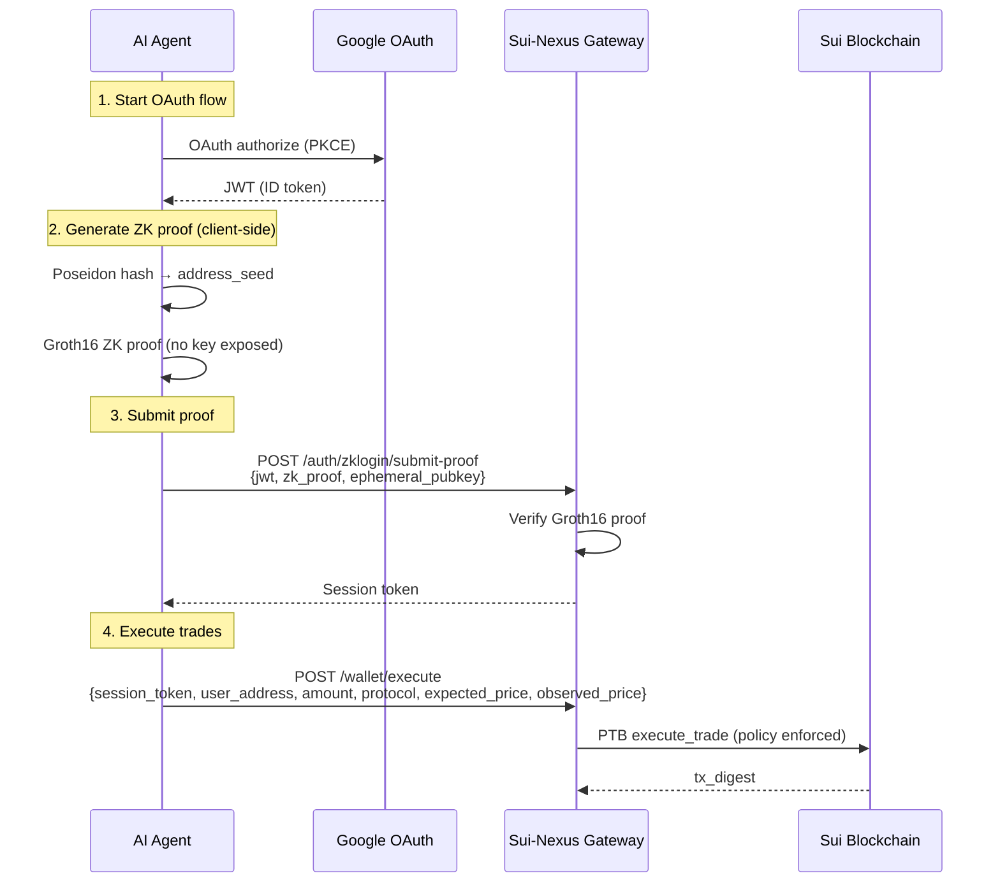

# zkLogin Google OAuth Setup Guide

## 为什么需要 Google OAuth

zkLogin 让 AI agent 通过 Google 账号登录 Sui，无需管理私钥。流程：
1. Agent 通过 Google OAuth 获取 JWT
2. 客户端用 JWT 生成 ZK proof（不暴露私钥）
3. Gateway 验证 proof 后发放 session token

## 设置步骤

### 1. 创建 Google Cloud 项目

1. 访问 [Google Cloud Console](https://console.cloud.google.com/)
2. 点击 "Select a project" → "New Project"
3. 项目名称：`sui-nexus-demo`（任意）
4. 点击 "Create"

### 2. 配置 OAuth 同意屏

1. 左侧菜单 → "APIs & Services" → "OAuth consent screen"
2. 选择 "External" → 点击 "Create"
3. App name: `Sui-Nexus zkLogin`
4. User type: "External"
5. 点击 "Save and Continue"
6. Scopes 页面：点击 "Add or Remove Scopes"
   - 勾选 `openid`、`email`、`profile`
7. 点击 "Save and Continue"
8. Test users 页面：点击 "Add Users"
   - 添加你的 Google 账号（用于测试）
9. 点击 "Save and Continue"

### 3. 创建 OAuth Credentials

1. 左侧菜单 → "APIs & Services" → "Credentials"
2. 点击 "Create Credentials" → "OAuth client ID"
3. Application type: "Web application"
4. Name: `Sui-Nexus Client`
5. Authorized redirect URIs: 点击 "Add URI"
   - 添加：`http://localhost:8080/api/v1/auth/zklogin/callback`
   - （生产环境需要真实域名）
6. 点击 "Create"
7. 复制显示的 **Client ID** 和 **Client Secret**

### 4. 导出环境变量

```bash
export ZKLOGIN_ENABLED="true"
export ZKLOGIN_CLIENT_ID="your-client-id.apps.googleusercontent.com"
export ZKLOGIN_CLIENT_SECRET="your-client-secret"
export ZKLOGIN_REDIRECT_URL="http://localhost:8080/api/v1/auth/zklogin/callback"
```

### 5. 测试 zkLogin 流程

```bash
# 重启 Gateway
HACKATHON_DEMO_MODE=false \
ZKLOGIN_ENABLED=true \
ZKLOGIN_CLIENT_ID="$ZKLOGIN_CLIENT_ID" \
ZKLOGIN_CLIENT_SECRET="$ZKLOGIN_CLIENT_SECRET" \
ZKLOGIN_REDIRECT_URL="http://localhost:8080/api/v1/auth/zklogin/callback" \
go run cmd/gateway/main.go &

# 访问 OAuth URL
open http://localhost:8080/api/v1/auth/zklogin
# 浏览器会跳转到 Google 登录，授权后返回 session token
```

## 当前绕过方案（已实现）

如果暂时不想配置 Google OAuth，项目已经支持**绕过模式**：

```bash
# 使用 testnet-session-token 直接提交交易
export DEMO_ZKLOGIN_ADDRESS="0x79ee84d793ed41f9868a63c7d0f2e62b2752ea0078944db44940b751d27a05a1"
export DEMO_ZKLOGIN_TOKEN="testnet-session-token"
```

这个绕过模式下：
- Agent 身份直接使用 `DEMO_ZKLOGIN_ADDRESS`
- Session token 设为 `testnet-session-token`
- Gateway 跳过 ephemeral key 验证，接受交易
- **所有 Move 合约调用仍然是真实的 on-chain 交易**

## zkLogin 技术细节



## 评委演示建议

| 场景 | 方案 | 效果 |
|------|------|------|
| 快速录制 | 绕过模式 (`testnet-session-token`) | 真实 on-chain 交易，快速 |
| 完整演示 | 真实 Google OAuth | 展示完整 zkLogin 流程，技术含量高 |

如果时间有限，推荐用绕过模式录制 **policy enforcement** 和 **on-chain verification** — 这些才是评委最看重的核心创新。zkLogin 身份认证在演示中可以一带而过："agent 通过 zkLogin 身份验证（此处用测试 token 代替 OAuth 流程）"。
